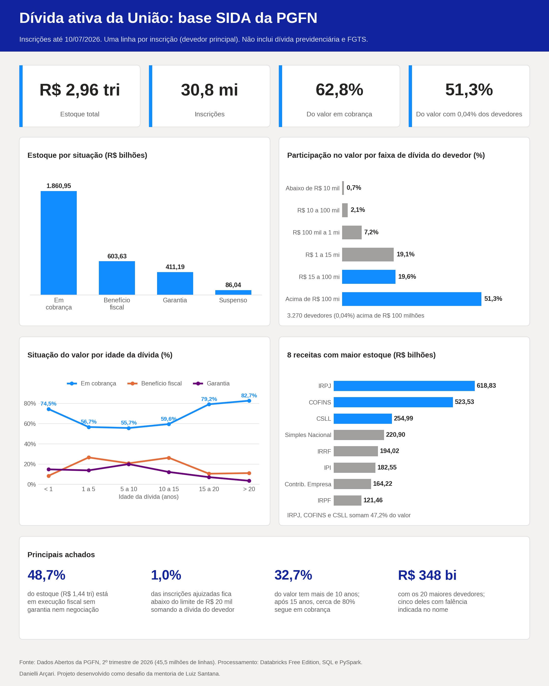

# Dívida ativa da União: quanto do estoque pode voltar aos cofres públicos?

A dívida ativa da União soma R$ 2,96 trilhões na base SIDA da PGFN. Parece dinheiro a receber, mas boa parte dele está parada há anos, concentrada em poucos devedores ou dependendo de processos judiciais. Este projeto parte de uma pergunta simples: **desse estoque, o que tem chance real de ser recuperado, e onde a cobrança deveria concentrar esforço?**

**[Abrir o notebook completo](https://danielli-arcari.github.io/analise-divida-ativa-pgfn/analise-divida-ativa-sida.html)**, com código, resultados, gráficos, memória de cálculo e recomendações.

Projeto desenvolvido como desafio da mentoria de Luiz Santana e publicado também no [LinkedIn](https://linkedin.com/in/danielli-arcari).

---

## O problema

A PGFN publica a base completa da dívida ativa: 45,5 milhões de linhas, em 6 arquivos que somam cerca de 9 GB. O volume impressiona, mas o número total esconde perguntas que importam para quem gerencia a cobrança: quanto já está negociado ou garantido, quem deve, há quanto tempo, e se a estratégia judicial está mirando as dívidas certas.

A primeira versão deste projeto tinha dois erros. Os valores estavam multiplicados por 100, porque o ponto decimal se perdeu na conversão, e as dívidas foram contadas mais de uma vez, porque a base repete cada inscrição para cada corresponsável, sempre com o valor integral. Somando todas as linhas, o estoque passaria de R$ 6,8 trilhões. Esta versão refaz todo o processo a partir da fonte original.

## O desafio

Transformar dados em informação útil para decisão, indo além dos gráficos: métricas explicadas, regras de negócio documentadas, recomendações e próximos passos. A tabela abaixo mostra onde cada item proposto na mentoria está respondido.

| Item do desafio | Onde está |
|---|---|
| 1. Base de dados | Base própria: dados abertos da PGFN ([Fonte e tabelas](#fonte-e-tabelas)) |
| 2. Métricas e visualizações | 8 análises e 9 gráficos no Databricks ([O que os dados mostraram](#o-que-os-dados-mostraram)) |
| 3. Compartilhamento | Post no LinkedIn com a imagem acima |
| 4. Memória de cálculo e análise | [Regras de negócio](#regras-de-negócio), [Métricas](#métricas) e [Decisões de negócio](#decisões-de-negócio) |
| 5. Fontes e objetivos | [Fonte e tabelas](#fonte-e-tabelas) e coluna "Pergunta de negócio" das análises |
| 6. Melhorias e decisões | [Decisões de negócio](#decisões-de-negócio) e [Melhorias e próximos passos](#melhorias-e-próximos-passos) |
| 7. Documentação e portfólio | Este README e o notebook completo |

## Como fiz

### Fonte e tabelas

- **Fonte:** [Dados Abertos da PGFN](https://dadosabertos.pgfn.gov.br), arquivo `Dados_abertos_Nao_Previdenciario.zip` do 2º trimestre de 2026.
- **Recorte:** base SIDA (Dívida Ativa Geral). A dívida previdenciária e a do FGTS ficam de fora, então os resultados não representam a dívida ativa da União como um todo.
- **Data de referência:** inscrições até 10/07/2026, a data mais recente presente na base.
- **Ferramenta:** Databricks Free Edition, com SQL e PySpark. Gráficos feitos no editor nativo de visualização.

Os dados foram organizados em camadas:

| Camada | Tabela | Conteúdo |
|---|---|---|
| Bronze | `bronze_sida` | 45.553.971 linhas como vieram da fonte, todas como texto, com o arquivo de origem e o trimestre |
| Silver | `silver_sida` | Todas as linhas com os tipos corrigidos (valor, data e indicador de ajuizamento) |
| Silver | `silver_inscricoes` | 30.845.336 inscrições, uma por linha, só com o devedor principal, mais a quantidade de corresponsáveis, de devedores solidários e a idade da dívida |
| Gold | `gold_situacao` | Quantidade, valor e mediana por situação e ajuizamento |
| Gold | `gold_uf_pessoa` | Inscrições, devedores e valor por UF e tipo de pessoa |
| Gold | `gold_idade` | Inscrições e valor por faixa de idade da dívida |

### O processo

1. **Ingestão:** download direto do site da PGFN para um Volume do Databricks, sem passar pela máquina local.
2. **Bronze:** carga de um CSV por vez em uma tabela Delta, apagando cada arquivo logo depois, para respeitar o limite de armazenamento da versão gratuita.
3. **Diagnóstico de qualidade:** contagem de linhas e inscrições por tipo de devedor, conversão de valores e datas. Nenhum dos 45,5 milhões de valores falhou na conversão.
4. **Silver:** tipagem e criação da tabela de uma linha por inscrição.
5. **Gold:** tabelas agregadas, com valores guardados em reais, sem arredondamento.
6. **Análises:** cada uma partindo de uma pergunta de negócio, com resultado, conclusão e gráfico.
7. **Documentação:** memória de cálculo, recomendações, limitações e próximos passos no próprio notebook.

### Principais dificuldades

- **A duplicação escondida.** Cada inscrição aparece uma vez para o devedor principal e uma vez para cada corresponsável ou devedor solidário, sempre com o valor integral. Os corresponsáveis, sozinhos, somam R$ 3,54 trilhões, mais que o estoque real. Sem esse diagnóstico, todas as análises de valor sairiam erradas.
- **Espaço de armazenamento.** O arquivo compactado tem 1,3 GB e os CSVs somam cerca de 9 GB. A solução foi descompactar, carregar e apagar um arquivo por vez.
- **Contar devedores, e não linhas.** A PGFN mascara parte do CPF das pessoas físicas, e uma mesma empresa aparece com vários CNPJs de filiais. Empresas foram agrupadas pela raiz do CNPJ, e pessoas físicas pelo CPF mascarado combinado com o nome.
- **Interpretar a regra jurídica.** A mediana das inscrições ajuizadas em cobrança ficou abaixo do limite de R$ 20 mil da Portaria MF nº 75/2012. Antes de concluir que a regra era descumprida, testei duas hipóteses: o período da inscrição e a soma das dívidas por devedor. A segunda explicou quase tudo.
- **Números no padrão brasileiro.** Os gráficos nativos usam ponto como separador decimal. Para exibir valores como 1.860,95, cada consulta gera uma coluna de texto com `TRANSLATE(FORMAT_NUMBER(valor, 2), ',.', '.,')`, usada nos rótulos.
- **Mediana aproximada.** Em 30 milhões de linhas, a mediana foi calculada com `PERCENTILE_APPROX`, que pode variar alguns reais entre execuções. Isso está declarado no notebook, e o texto reflete a última execução de cada consulta.

### Regras de negócio

1. **Uma linha por inscrição:** só o devedor principal entra nas métricas de valor.
2. **Valor da dívida:** campo `VALOR_CONSOLIDADO`, que é o débito originário atualizado com encargos e acréscimos legais (art. 1º, § 2º, da Portaria MF nº 75/2012).
3. **Idade da dívida:** dias entre a data de inscrição e 10/07/2026, divididos por 365,25.
4. **Ajuizamento:** inscrição com `INDICADOR_AJUIZADO` igual a "SIM".
5. **Situação:** as categorias de `TIPO_SITUACAO_INSCRICAO` (em cobrança, benefício fiscal, garantia, suspenso por decisão judicial e em negociação).
6. **Devedor:** empresas agrupadas pela raiz do CNPJ (8 primeiros dígitos) nas análises de concentração e de maiores devedores; CPF ou CNPJ completo com o nome na análise da portaria e na geográfica.
7. **Limite de ajuizamento:** R$ 20 mil (art. 1º, II, da Portaria MF nº 75/2012), com corte em 29/03/2012 pela data de inscrição.
8. **UF sem informação:** 245 inscrições com UF "Si" identificadas como "Sem informação".
9. **Indício de falência:** nome do devedor com os termos FALID, RECUPERACAO JUDICIAL ou LIQUIDACAO.

### Métricas

| Métrica | Como foi calculada |
|---|---|
| Inscrições | Contagem de linhas da `silver_inscricoes` |
| Valor (R$ bilhões) | Soma do valor consolidado, dividida por 1 bilhão |
| % do valor | Valor do grupo dividido pelo valor total do recorte |
| Valor mediano | `PERCENTILE_APPROX` com percentil de 50%, para mostrar o valor típico sem a distorção das dívidas bilionárias |
| % com corresponsável | Inscrições com pelo menos um corresponsável sobre o total da faixa |
| Média de corresponsáveis | Média calculada só entre as inscrições que têm corresponsável |

A última métrica merece explicação. A média geral de corresponsáveis mistura duas perguntas diferentes: quantas dívidas têm corresponsável e quantas pessoas respondem por elas. Separei as duas. O percentual responde à primeira; a média, calculada só onde há corresponsável, responde à segunda. Foi essa separação que revelou o padrão da análise 6.7.

## O que os dados mostraram

| Análise | Pergunta de negócio | O que o gráfico revela |
|---|---|---|
| 6.1 Situação | Quanto do estoque está disponível para cobrança e quanto já está negociado, garantido ou suspenso? | 62,8% (R$ 1,86 trilhão) está em cobrança. A garantia soma 13,9% do valor em apenas 71.394 inscrições |
| 6.2 Ajuizamento | A cobrança judicial está direcionada às dívidas de maior valor? | As ajuizadas são cerca de 20% das inscrições e 78% do valor. O maior bloco da carteira é a execução sem garantia: R$ 1,44 trilhão (48,7%) |
| 6.2.1 Portaria | O limite de R$ 20 mil para ajuizar está sendo respeitado? | Metade das ajuizadas tem valor individual até R$ 20 mil, mas só 1,0% continua abaixo do limite somando a dívida do devedor |
| 6.3 Concentração | Quantos devedores respondem pela maior parte do estoque? | 3.270 devedores (0,04%) concentram 51,3% do valor; 19.804 (0,24%) chegam a 71% |
| 6.4 Geografia | Em quais estados a dívida está e ela é de empresas ou de pessoas? | SP concentra 40,8% e, com RJ, 55,4%. Em todos os estados, empresas respondem por mais de 75% do valor |
| 6.5 Idade | A dívida está sendo resolvida ou envelhecendo? | 32,7% do valor tem mais de 10 anos. Depois dos 15 anos, a parcela em cobrança sobe para 79,2% e 82,7% |
| 6.6 Origem | Quais tributos geram a maior parte do estoque? | IRPJ, COFINS e CSLL somam 47,2%. O Simples Nacional tem o maior número de inscrições, mas só 7,5% do valor |
| 6.7 Corresponsáveis | Em quais dívidas há mais de uma pessoa a quem cobrar? | Quando há corresponsável, a média sobe de 1,1 pessoa nas dívidas abaixo de R$ 10 mil para 5,2 acima de R$ 100 milhões |
| 6.8 Maiores devedores | Os 20 maiores devedores empresariais estão em cobrança, negociados ou garantidos? | Somam R$ 348,1 bilhões. R$ 231,9 bilhões estão negociados ou garantidos; os demais estão em cobrança, com cinco empresas falidas somando R$ 68,8 bilhões |

## Decisões de negócio

A leitura conjunta das análises mostra duas carteiras muito diferentes dentro do mesmo estoque, e sugere estas estratégias:

1. **Dois modelos de cobrança.** Atuação individualizada para os devedores acima de R$ 15 milhões, que concentram R$ 2,10 trilhões, e cobrança em massa, como protesto e transação por adesão, para os 7,3 milhões de devedores abaixo de R$ 100 mil, que somam 2,8% do valor.
2. **Agir cedo.** 74,5% do valor inscrito no último ano está em cobrança, sem negociação nem garantia. É a janela com mais chance de sucesso, antes que o devedor perca patrimônio.
3. **Tratar a dívida antiga como um bloco separado.** As inscrições com mais de 15 anos somam R$ 524,22 bilhões, com cerca de 80% em cobrança. Uma triagem pode separar o valor contábil do valor com perspectiva real de recuperação.
4. **Usar os corresponsáveis.** Nas dívidas acima de R$ 15 milhões, mais de um terço das inscrições tem corresponsável, com média de 4,2 a 5,2 pessoas. A pesquisa patrimonial deles pode ampliar a recuperação nas execuções sem garantia.
5. **Monitorar os benefícios fiscais.** R$ 603,63 bilhões dependem de o devedor continuar pagando os parcelamentos e transações.
6. **Acompanhar os grandes devedores falidos** pelos processos falimentares, sem esperar recuperação por ações de cobrança comuns.
7. **Programas por origem da dívida:** negociação em massa para o Simples Nacional e atuação individualizada sobre os grandes devedores de IRPJ, CSLL e IPI.

Essas recomendações partem só dos dados públicos. Não consideram custos operacionais nem a estratégia já adotada pela PGFN, que usa vários desses instrumentos.

## Limitações

- O recorte é só a base SIDA, sem dívida previdenciária e FGTS.
- É uma fotografia de um trimestre: não mostra o que entrou, saiu ou foi pago ao longo do tempo.
- A base não traz dados de pagamento nem a data do ajuizamento. A análise da portaria usa a data de inscrição como aproximação.
- Os valores incluem juros e encargos até 2026, então dívidas antigas aparecem maiores do que eram na origem.
- A UF é a do domicílio fiscal, o que favorece estados com sedes de grandes grupos.
- O indício de falência depende do nome registrado e não captura todos os casos.

## Melhorias e próximos passos

- **Série histórica:** carregar os trimestres anteriores para medir entrada, saída e envelhecimento do estoque.
- **Visão completa:** incluir as bases previdenciária e do FGTS.
- **Dados cadastrais:** cruzar a raiz do CNPJ com os dados abertos da Receita Federal para identificar empresas baixadas ou falidas com mais precisão.
- **Contexto econômico:** comparar a participação de cada estado no estoque com sua participação no PIB.
- **Qualidade e automação:** transformar as conferências manuais em testes automáticos e agendar a carga trimestral com Databricks Jobs.
- **Dashboard:** montar um painel de acompanhamento no Databricks com os indicadores principais.

---

**Danielli Arçari**, analista de dados em transição de carreira, com 17 anos de experiência na área jurídica.
[LinkedIn](https://linkedin.com/in/danielli-arcari) | [GitHub](https://github.com/danielli-arcari) | [Portfólio](https://danielliarcari.vercel.app)
